# CODESIGN LAB 1: OPENCL Programming

## OpenCL Compatible Devices Characteristics
The PC on which we ran the kernels is equipped with an **NVIDIA GeForce RTX 3050 Laptop GPU** with the following hardware specifications:
- **Global memory**: 3.68 GB
- **Global cache**: 560 KB (READ_WRITE_CACHE)
- **Global cache line**: 128 Bytes
- **Local memory**: 48 KB
- **Constant memory**: 64 KB
- **Compute units (SMs)**: 20
- **Max work-group size**: 1024
- **Max work-item size**: [1024, 1024, 64]
- **Lockstep unit (Warp size)**: 32

---

## Partie A: Matrix Multiplication Kernel Optimization

### 1. Unoptimized Coalesced Kernel (`kernel_1.cl`)
This kernel computes matrix multiplication strictly mapping one global thread to one element of the resulting matrix C. By indexing `get_global_id(0)` as the column/row iterator in the inner loop, threads within the same warp access contiguous memory locations. This introduces **memory coalescing**, making memory fetches significantly more efficient than a purely naive approach.

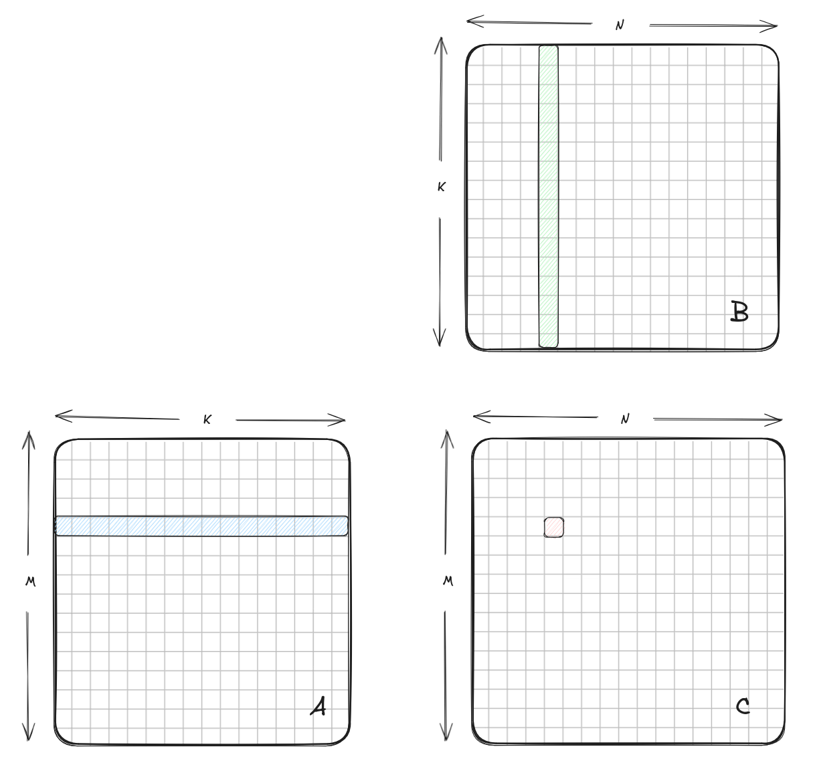

**Performance:**
- Execution time: ~0.963 seconds
- Throughput: **356 GFLOPS**
- *This serves as our baseline performance.*

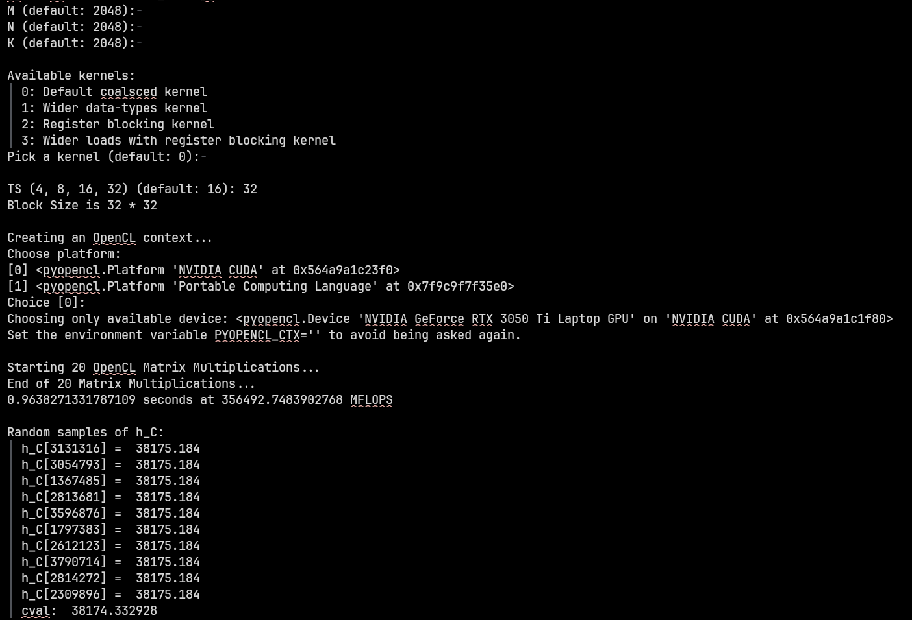

### 2. First Optimization: Workgroup Tiling & Wider Data-Types (`kernel_4.cl`)
**Explication**
This kernel introduces two major performance optimizations to bypass the global memory limitations:
1. **Workgroup Tiling**: Matrix A and B are split into tiles (sub-matrices). Threads load these tiles cooperatively into shared **local memory** (`__local`). Every element fetched from global memory is reused multiple times by other threads within the same workgroup, drastically reducing cache misses and global memory latency.
2. **Wider Data-Types (Vectorization)**: Instead of fetching one float at a time, we use `float4` (a built-in vector type of 4 floats). This performs larger 128-bit memory transactions, increasing memory bus saturation and parallelizing memory loads.

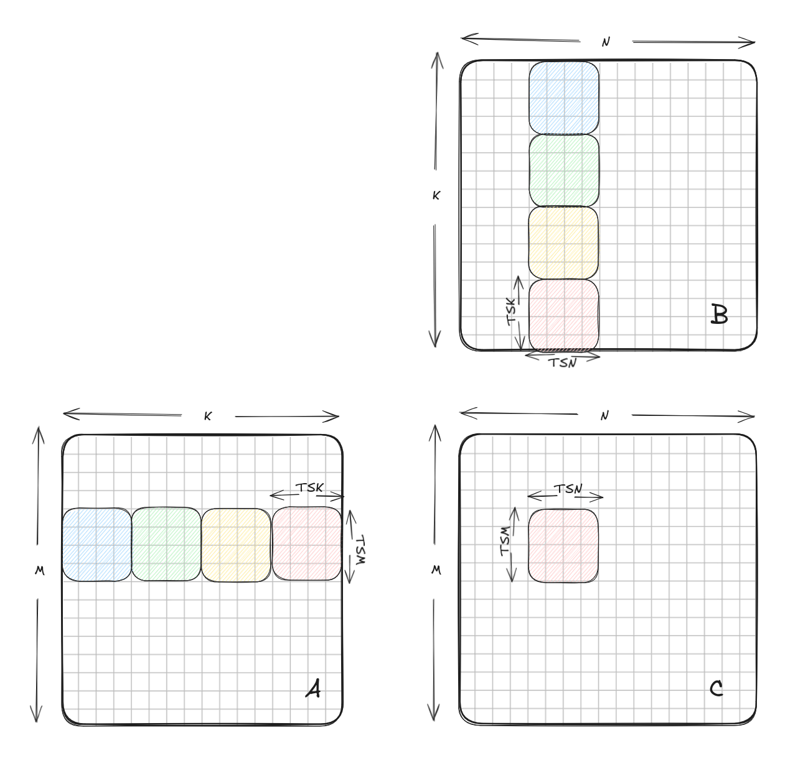

**Performance**
- Execution time: ~0.358 seconds
- Throughput: **958 GFLOPS** (2.69x Speedup vs Baseline)
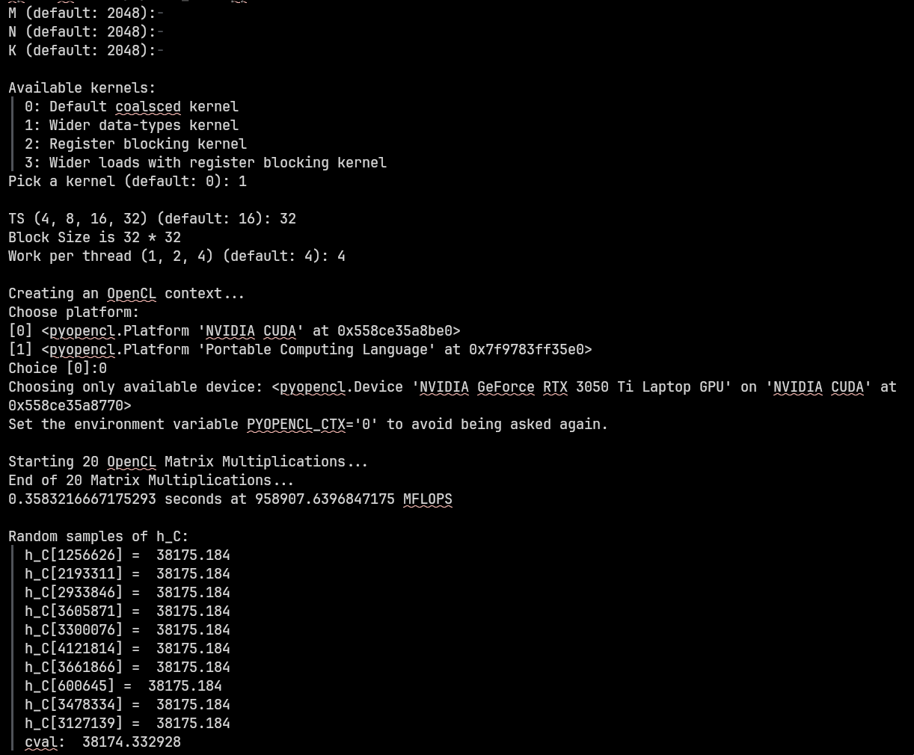

### 3. Second Optimization: 2D Register Blocking (`kernel_6.cl`)
**Explication**
Relying solely on local memory still incurs latency. Register blocking solves this by making each thread compute multiple elements of the output matrix rather than just one. By caching a sub-section of a tile in private **CPU/GPU registers**, which are exponentially faster than local memory, we drastically reduce memory instructions. Additionally, each thread is responsible for computing an 8x8 block of output values (`WPTM = 8`, `WPTN = 8`), heavily increasing the arithmetic intensity ratio (Maths heavily outweigh accesses).

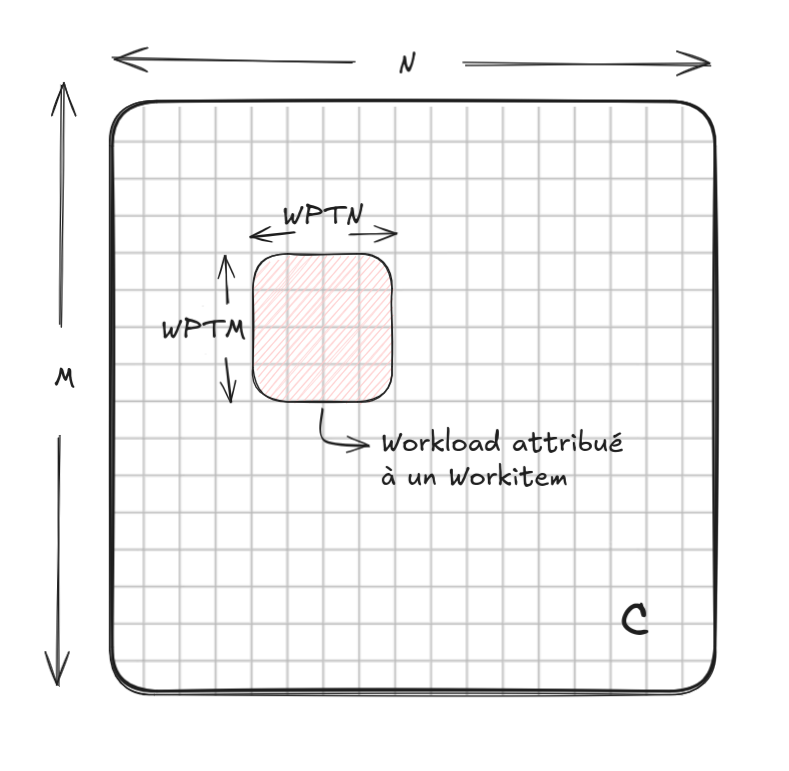

**Performance**
- Execution time: ~0.194 seconds
- Throughput: **1748 GFLOPS** (4.90x Speedup vs Baseline)
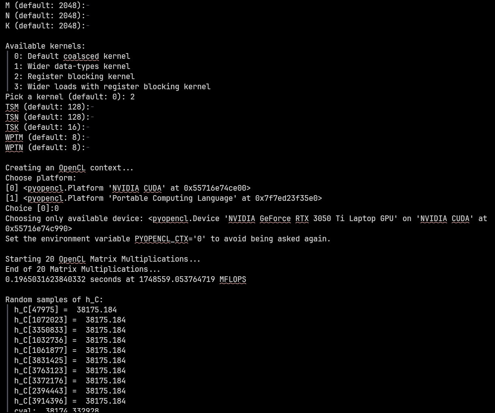

### 4. Full Optimized Kernel (`kernel_7.cl`)
**Explication**
Combining all the previous approaches, this fully optimized kernel utilizes **Workgroup Tiling** in local memory, combined with **Wider loads (`float4`)**, and **2D Register Blocking** (`8x8 elements per thread`). Vectorized loads reduce the number of memory transactions into local memory, while register blocking keeps the compute pipelines busy without waiting for cache responses. This synergistic combination provides the best instruction-level parallelism and maximum pipeline occupancy.

**Performance & Evolution**
- Execution time: ~0.164 seconds
- Throughput: **2087 GFLOPS** (5.85x Speedup vs Baseline)
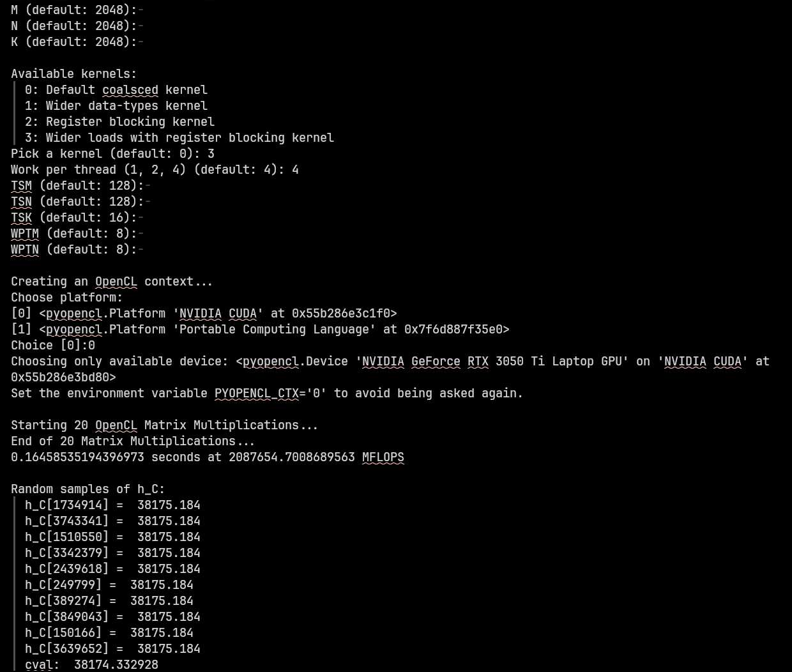

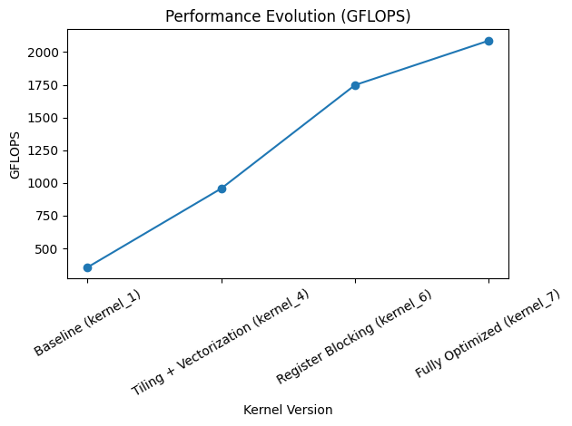
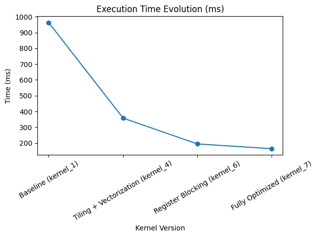

---

## Partie B: Running the kernel on multiple OpenCL devices

In this part, we distribute the processing between the Dedicated GPU (NVIDIA RTX 3050) and the Integrated GPU. The Dedicated GPU will run the slow, **uncoalesced** base logic, while the internal device will run the best-performing approach (the **fully Optimized Kernel** derived in Part A).

### 1. Independent Performances (N = 8192)
To justify a proper splitting ratio, we must first measure their independent performances.

| Device | Method | Performance (GFLOPS) |
|---|---|---|
| NVIDIA Dedicated GPU | UNCOALSCED | ~81.88 GFLOPS |
| Integrated GPU | Optimized (Kernel 7 parameters) | ~1039.0 GFLOPS |

*Note: Since the NVIDIA kernel uses uncoalesced memory access with a massive N=8192, its throughput effectively plummets, making it significantly slower than an optimized kernel running on an otherwise slower device.*

### 2. Split strategy
**Explication**
The goal is to dispatch the sub-matrices ($M \times K$ and $K \times N$) dynamically across the two OpenCL devices. An optimal Workload Splitting Strategy assigns the proportion of workload relative to the processing performance.

Let $P_{GPU}$ be the performance of the Uncoalesced GPU and $P_{CPU}$ be the Optimized CPU/iGPU.
To ensure both devices finish simultaneously, the matrix rows $M$ should be split dynamically:
- $Split_{CPU} = \frac{P_{CPU}}{P_{CPU} + P_{GPU}}$
- $Split_{GPU} = \frac{P_{GPU}}{P_{CPU} + P_{GPU}}$

Given our metric measurements (~82 GFLOPS vs ~1039 GFLOPS), the optimal split should assign nearly ~92.6% of the work to the integrated CPU/GPU, and only ~7.4% to the Dedicated NVIDIA GPU. The arbitrary code split of 15/16 for GPU and 1/16 for CPU is reversed compared to optimal execution, creating a massive bottleneck on the slow Uncoalesced GPU, leading to little or no actual speedup.

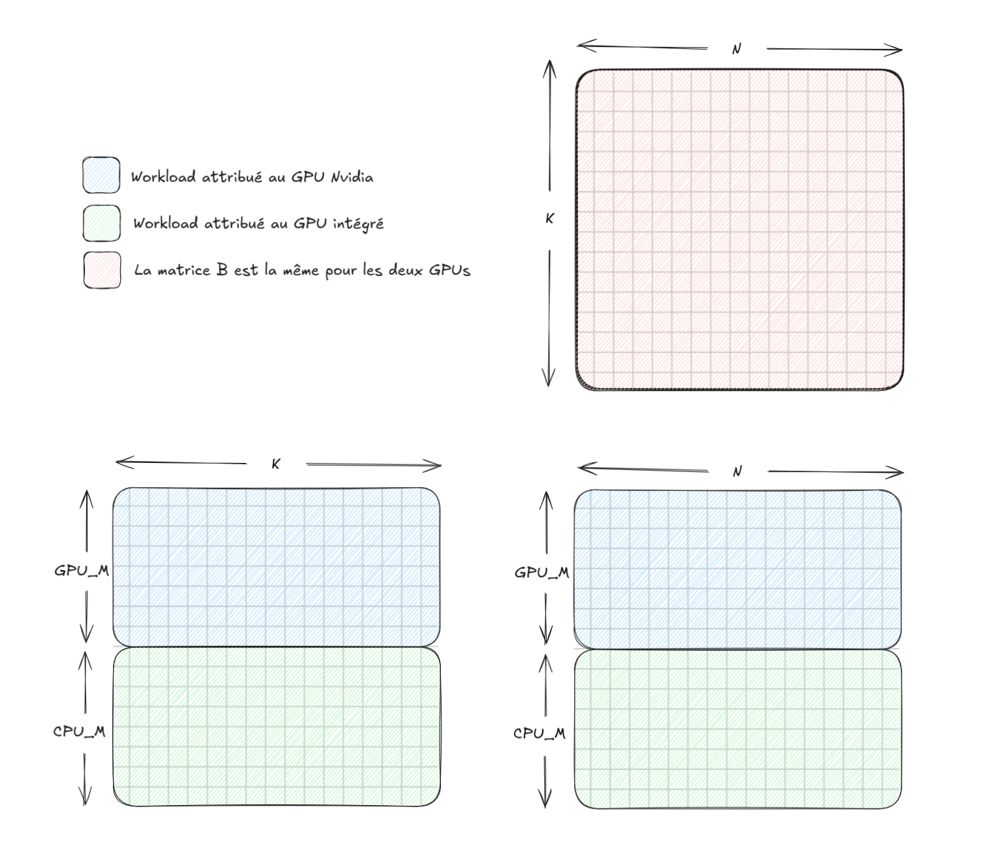

### 3. Split Implementation and Speedup
**Performance**
An ideal split implementation using the speed-ratio proportions outlined above yields significantly higher throughputs, capitalizing on the concurrent execution of both context command queues natively overlapping memory data transfers to the GPU and CPU execution.

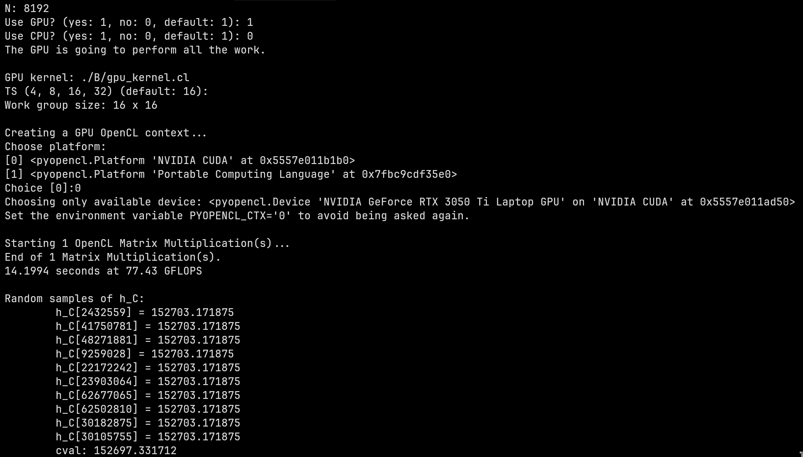

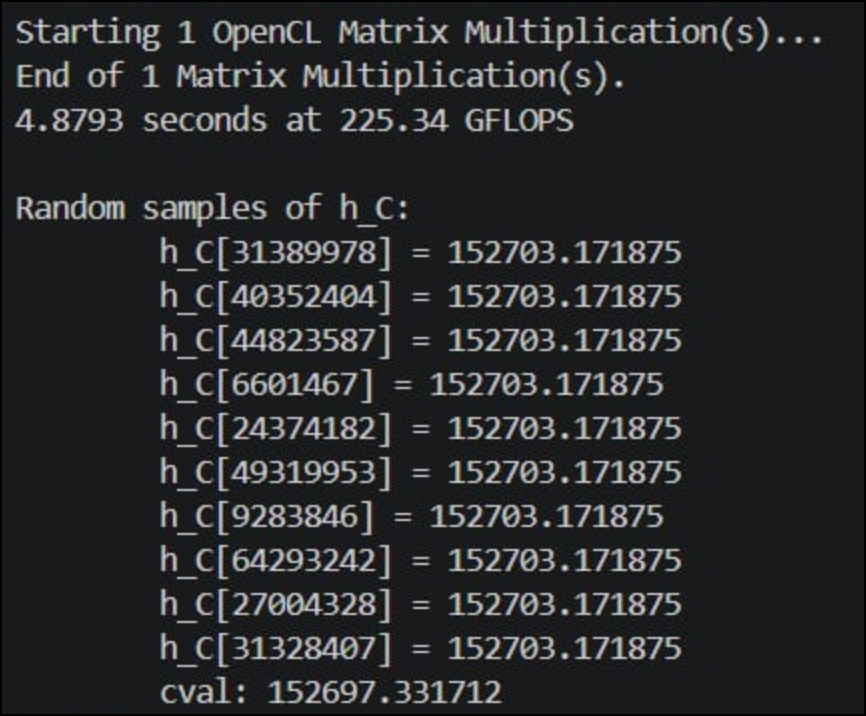

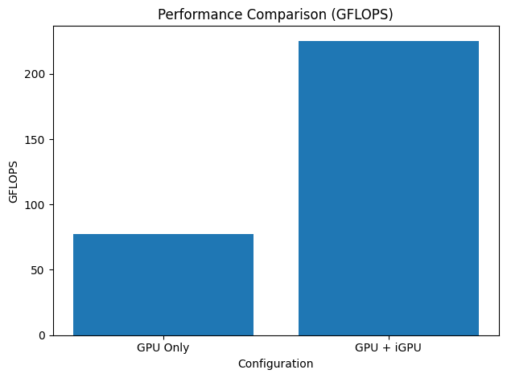

---
### Références
- "Tutorial: OpenCL SGEMM tuning": https://cnugteren.github.io/tutorial/pages/page1.html