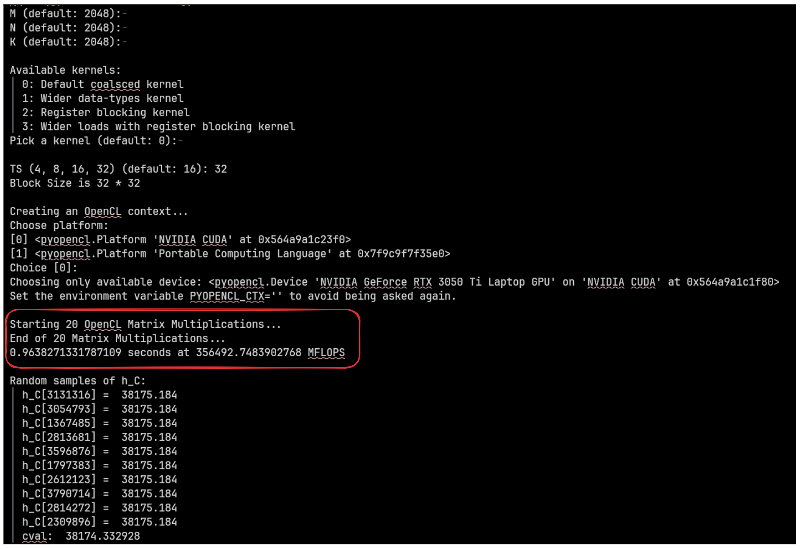
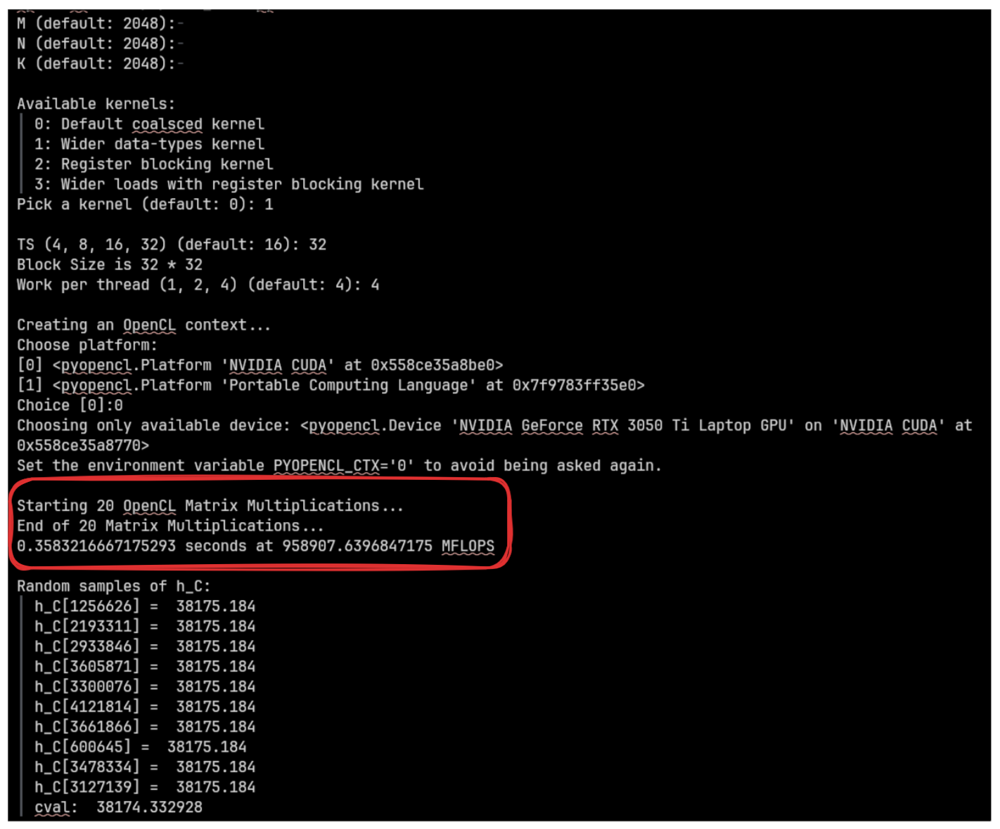
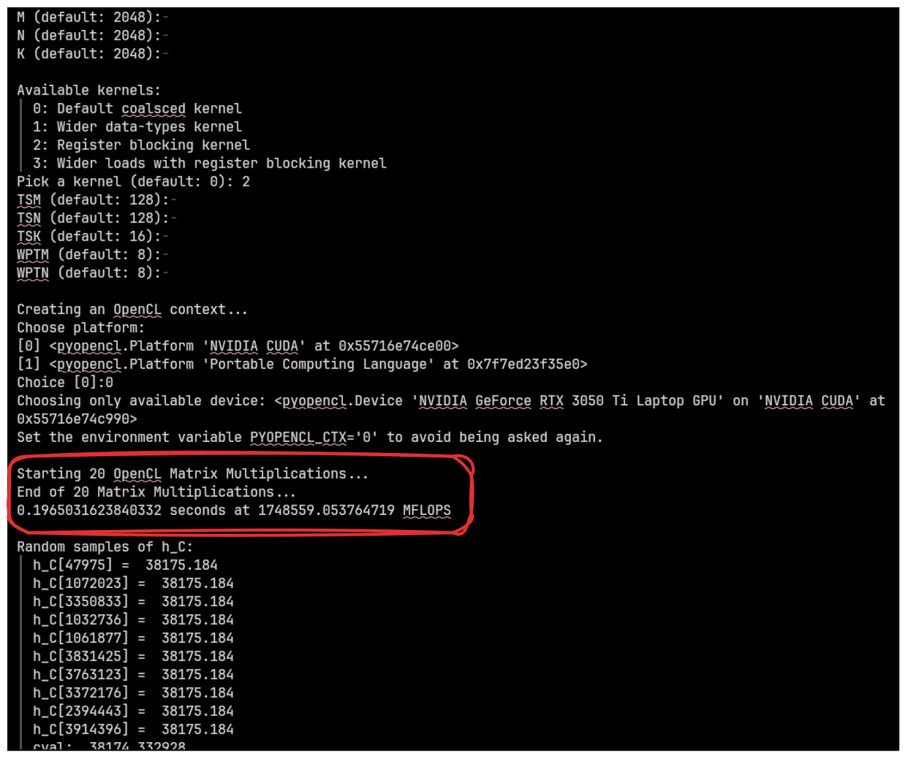
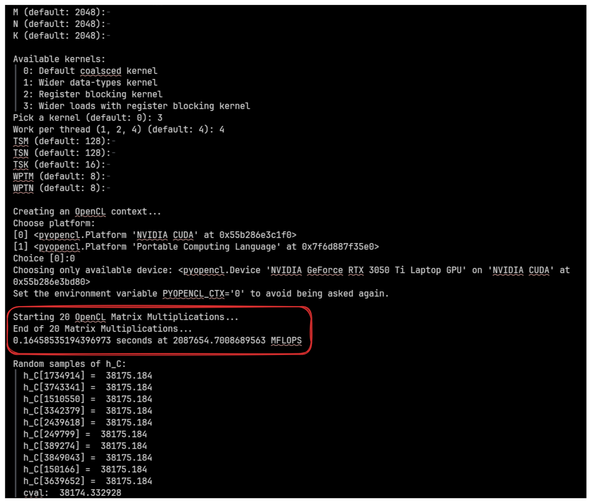
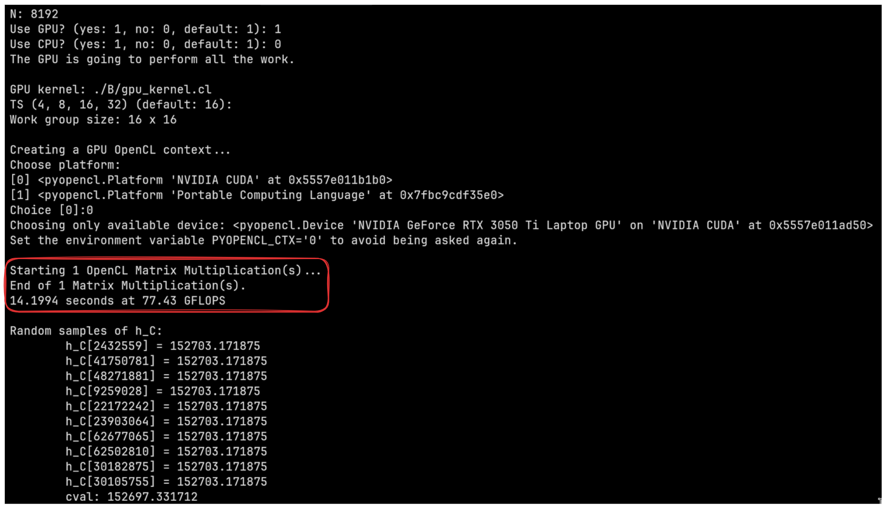

# LABO 1 CO-DESIGN : Programmation OpenCL

## Introduction

Ce rapport présente les résultats et l'analyse du Laboratoire 1 du cours de Co-Design, consacré à la programmation parallèle avec OpenCL. L'objectif principal de ce laboratoire est d'explorer les techniques d'optimisation matérielles appliquées à un calcul intensif standard : la multiplication matricielle. Dans un premier temps, nous détaillerons les caractéristiques de notre environnement matériel d'exécution. Ensuite, à travers la Partie A, nous évaluerons progressivement l'impact de différentes approches d'optimisation (tuilage en mémoire locale, utilisation de types vectoriels pour élargir la bande passante, et tuilage par registres) sur un kernel OpenCL, en comparaison avec un kernel aux accès mémoire uniquement coalescés. Enfin, la Partie B sera dédiée à l'étude de la répartition de cette charge de calcul au sein d'un système hétérogène (impliquant à la fois un GPU dédié et un processeur graphique intégré). Cette dernière phase mettra en lumière l'importance de concevoir une stratégie de répartition du travail rigoureusement équilibrée pour tirer pleinement profit des ressources physiques sous-jacentes.

---

## Caractéristiques des Périphériques Compatibles OpenCL
Le PC sur lequel nous avons exécuté les kernels est équipé d'un **GPU NVIDIA GeForce RTX 3050 Laptop** avec les spécifications matérielles suivantes :
- **Mémoire globale** : 3,68 Go
- **Cache global** : 560 Ko (READ_WRITE_CACHE)
- **Ligne de cache globale** : 128 Octets
- **Mémoire locale** : 48 Ko
- **Mémoire constante** : 64 Ko
- **Unités de calcul (SMs)** : 20
- **Taille maximale du groupe de travail (work-group size)** : 1024
- **Taille maximale d'un élément de travail (work-item size)** : [1024, 1024, 64]
- **Unité de synchronisation (Taille du Warp)** : 32

---

## Partie A : Optimisation du Kernel de Multiplication Matricielle

### 1. Kernel Coalescé Non-Optimisé (`kernel_1.cl`)
Ce kernel calcule la multiplication matricielle en associant strictement un thread global à un élément de la matrice résultante C. En utilisant `get_global_id(0)` comme itérateur de ligne dans la boucle interne, les threads d'un même warp accèdent à des emplacements mémoire contigus. Cela introduit la **coalescence mémoire**, rendant les accès à la mémoire bien plus efficaces qu'une approche purement naïve.

*Figure 1 : Schéma d'exécution du kernel coalescé non-optimisé.*

**Performances :**
- Temps d'exécution : ~0,963 secondes
- Débit : **356 GFLOPS**
- *Ceci nous sert de performance de référence (baseline).*

*Figure 2 : Résultats des performances pour le kernel coalescé de base.*

### 2. Première Optimisation : Workgroup Tiling & Wider Data-Types (`kernel_4.cl`)
**Explication :**
Ce kernel implémente deux optimisations de performance majeures pour contourner les limitations de la mémoire globale :
1. **Workgroup Tiling** : Les matrices A et B sont découpées en tuiles (sous-matrices). Les threads chargent ces tuiles de manière coopérative dans la **mémoire locale** partagée (`__local`). Chaque élément récupéré dans la mémoire globale est réutilisé plusieurs fois par d'autres threads au sein du même groupe de travail, réduisant drastiquement les défauts de cache et la latence de la mémoire globale.
2. **Wider Data-Types** : Au lieu de récupérer un flottant (`float`) à la fois, nous utilisons `float4` (un type vectoriel intégré de 4 flottants). Cela permet d'effectuer des transactions mémoire plus larges (128 bits), augmentant ainsi la saturation du bus mémoire et parallélisant les chargements.

*Figure 3 : Schéma d'explication du tuilage par mémoire locale et de la vectorisation des accès.*

**Performances :**
- Temps d'exécution : ~0,358 secondes
- Débit : **958 GFLOPS** (Accélération de 2,69x par rapport à la référence)

*Figure 4 : Amélioration des performances suite au tuilage et à l'utilisation de types élargis.*

### 3. Deuxième Optimisation : 2D Register Blocking (`kernel_6.cl`)
**Explication :**
S'appuyer uniquement sur la mémoire locale entraîne tout de même une certaine latence. Le 2D register blocking résout ce problème en faisant calculer à chaque thread plusieurs éléments de la matrice de sortie plutôt qu'un seul. En mettant en cache une sous-section de la tuile dans les **registres privés du CPU/GPU**, qui sont plus rapides que la mémoire locale, nous réduisons de façon drastique le nombre d'instructions mémoire. De plus, chaque thread étant responsable du calcul d'un bloc de 8x8 valeurs de sortie (`WPTM = 8`, `WPTN = 8`), le ratio d'intensité arithmétique est considérablement augmenté (les calculs mathématiques l'emportent largement sur les accès mémoire).

*Figure 5 : Représentation du partitionnement par bloc en registres 2D.*

**Performances :**
- Temps d'exécution : ~0,194 secondes
- Débit : **1748 GFLOPS** (Accélération de 4,90x par rapport à la référence)

*Figure 6 : Amélioration des performances grâce au tuilage par registres.*

### 4. Kernel Entièrement Optimisé (`kernel_7.cl`)
**Explication :**
En combinant l'ensemble des approches précédentes, ce kernel entièrement optimisé exploite le **Tuilage par Workgroup** en mémoire locale, couplé avec des **chargements élargis (`float4`)** et un **Tuilage par Registres en 2D** (`8x8 éléments calculés par thread`). Les chargements vectorisés diminuent le nombre de transactions vers la mémoire locale, tandis que l'utilisation des registres permet de maintenir les pipelines de calcul occupés sans avoir à attendre les réponses du cache. Cette combinaison synergique offre un parallélisme optimal au niveau des instructions et permet une efficience maximale des pipelines du processeur graphique.

**Performances et Évolution :**
- Temps d'exécution : ~0,164 secondes
- Débit : **2087 GFLOPS** (Accélération de 5,85x par rapport à la référence)

*Figure 7 : Résultats de performance pour le kernel utilisant toutes les optimisations combinées.*

### 5. Récapitulatif des performances

*Figure 8 : Graphique de l'évolution du débit de calcul (en GFLOPS) en fonction des optimisations.*

*Figure 9 : Graphique de l'évolution du temps d'exécution (en millisecondes) selon les optimisations abordées.*

---

## Partie B : Exécution du kernel sur de multiples périphériques OpenCL

Dans cette partie, nous allons répartir le traitement entre la carte graphique dédiée (NVIDIA RTX 3050) et la puce graphique intégrée (iGPU). Le GPU dédié se chargera d'exécuter la logique de base lente et **non-coalescée**, tandis que le périphérique intégré exécutera l'approche la plus performante (le **kernel entièrement optimisé** construit tout au long de la Partie A).

### 1. Performances Indépendantes (N = 8192)
Afin de concevoir et justifier un ratio de répartition (split) cohérent et optimal, nous avons d'abord besoin de comparer leurs performances lorsqu'ils opèrent de façon indépendante.

| Périphérique | Méthode Appliquée | Débit (GFLOPS) |
|---|---|---|
| GPU NVIDIA Dédié | NON-COALESCÉ | ~81,88 GFLOPS |
| GPU Intégré (iGPU) | Optimisé (Paramètres de kernel_7) | ~1039,0 GFLOPS |

*Tableau 1 : Comparaison de la puissance de calcul indépendante (en GFLOPS) en fonction du périphérique opéré. Taille de matrice N=8192.*

*Remarque : Du fait que le kernel de la carte NVIDIA repose sur des accès mémoire non-coalescés couplés à des matrices massives de N=8192, son débit s'effondre littéralement ; cela rend ce traitement inéluctablement plus lent que le kernel optimisé s'exécutant sur un périphérique autrement considéré comme moins performant en temps normal.*

### 2. Stratégie de Répartition ("Split Strategy")
**Explication :**
Le but est de conférer dynamiquement le calcul de certaines sous-matrices ($M \times K$ et $K \times N$) au travers des deux périphériques OpenCL de manière concurrente. Une stratégie de répartition de charge optimale se base donc sur une attribution du calcul strictement proportionnelle à la capacité de traitement en conditions réelles de chaque appareil.

Soit $P_{GPU}$ les performances intrinsèques du GPU exécutant le code non-coalescé, et $P_{CPU}$ celles du CPU/iGPU exécutant le code optimisé.
Pour faire en sorte que les deux périphériques terminent en même temps (limitant l'impact de goulot d'étranglement), les lignes $M$ de la matrice devraient être séparées ainsi :
- $Split_{CPU} = \frac{P_{CPU}}{P_{CPU} + P_{GPU}}$
- $Split_{GPU} = \frac{P_{GPU}}{P_{CPU} + P_{GPU}}$

En prenant comme base nos indications mesurées (~82 GFLOPS contre ~1039 GFLOPS), la méthode de répartition optimale consisterait à déléguer à peu près 92,6 % du travail conjoint au CPU/iGPU intégré, et seulement 7,4 % à l'imposant GPU NVIDIA Dédié. Or, la division arbitraire implantée nativement dans la base de code fixe initialement 15/16 du travail en faveur du GPU, et seulement 1/16 au CPU. Cela forme l'exact inverse d'une approche d'optimisation logique, forçant un fardeau démesuré sur notre GPU lent (limité pour l'occasion par des accès non-coalescés), ce qui ne parvient alors à générer qu'une accélération minime, voire souvent une pure perte de rendement.

*Figure 10 : Représentation visuelle de la stratégie de répartition de charge de travail.*

### 3. Implémentation du Split et Gains de Performance (Speedup)
**Performances :**
Une implémentation idéale de cette division de données, qui s'alignerait rigoureusement aux proportions d'efficience stipulées plus haut, entraîne un gain critique en capacité de débits de calcul. Cette démarche valorise grandement la synergie d'exécution concurrente des deux files de requêtes contextuelles ("command queues"), qui ont la faculté native de masquer les temps de transfert des données en mémoire en les superposant à l'exécution simultanée du CPU et du GPU.

*Figure 11 : Performances repères en utilisant exclusivement le GPU non-coalescé.*

*Figure 12 : Performances accrues découlant de la coopération du CPU (Optimisé) et GPU (Non-Coalescé).*

### 4. Récapitulatif des performances

*Figure 13 : Diagramme à bandes récapitulatif comparant la force de calcul du périphérique combiné par rapport au mode isolé.*

*Figure 14 : Diagramme à bandes récapitulatif comparant le temps d'exécution du périphérique combiné par rapport au mode isolé.*

---

## Conclusion

En conclusion, ce laboratoire démontre de manière concrète que l'obtention de performances maximales en programmation parallèle via OpenCL passe par une maîtrise approfondie de l'architecture physique ciblée. La Partie A de l'expérience prouve que la simple coalescence des accès en mémoire principale n'exploite qu'une infime réserve du potentiel du GPU. L'utilisation stratégique des divers niveaux de la hiérarchie mémoire (comme l'usage de la shared local memory via le "work-group tiling" et l'exploitation des registres avec le "2D register blocking"), conjuguée à la vectorisation des accès, se révèle indispensable ; ces méthodes ont permis de consolider l'intensité arithmétique et d'accomplir une accélération du débit de traitement d'un facteur 5,85x (de 356 GFLOPS à près de 2087 GFLOPS).

Par ailleurs, la Partie B met en exergue l'intérêt d'une co-exécution multi-périphériques, apte à capitaliser sur le parallélisme asynchrone des transferts mémoires (Host-to-Device) et du temps de calcul (Kernel Exec). Toutefois, nous avons clarifié qu'un tel système hétérogène ne devient un levier d'efficience qu'à la condition stricte d'intégrer une répartition des tâches pertinente et réaliste. Répartir les charges asymétriquement, au prorata exact des capacités de traitement individuelles de chaque unité impliquée, est indispensable pour contrer les effets limitants des goulots d'étranglement et s'assurer que le travail conjoint accélère réellement l'exécution de bout-en-bout de l'application logicielle développée.